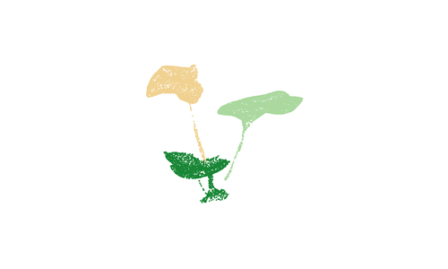

# Plant Point Clouds Segmentation
This implementation is based on A. Paturkar, G. S. Gupta and D. Bailey, "Plant Trait Segmentation for Plant Growth Monitoring," 
2020 35th International Conference on Image and Vision Computing New Zealand (IVCNZ), Wellington, New Zealand, 2020, pp. 1-6, 
doi: 10.1109/IVCNZ51579.2020.9290575.

  

For more insights, be free to read the following paper.

 BibTex

 @INPROCEEDINGS{9290575,

 author={Paturkar, Abhipray and Gupta, Gourab Sen and Bailey, Donald}, 

 booktitle={2020 35th International Conference on Image and Vision Computing New Zealand (IVCNZ)}, 
 

 title={Plant Trait Segmentation for Plant Growth Monitoring}, 

 year={2020},

 volume={},  

 number={},  

 pages={1-6},

 doi={10.1109/IVCNZ51579.2020.9290575}} 

